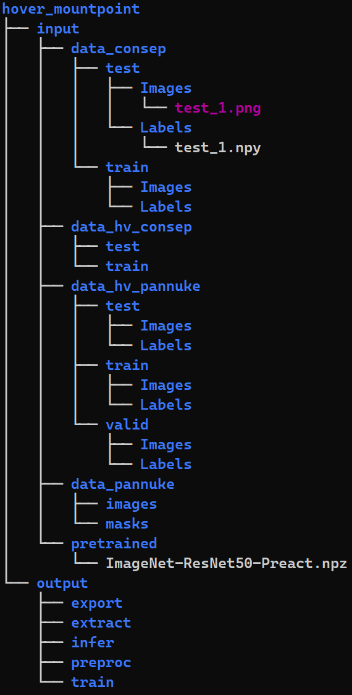

1. Install or verify that the following on your system:
 - Docker 
 - Nvidia-drivers
 - Nvidia docker
 - CUDA & cuDNN

2. Build image from sources
Run `docker build -t hover:1.0 .`in Dockerfiles folder.

3. Make a file structure for mounting to container
e.g. </data/input/some_dataset/Images/>, </data/output/infer/>

4. Modify <launch.sh> script and run it.
